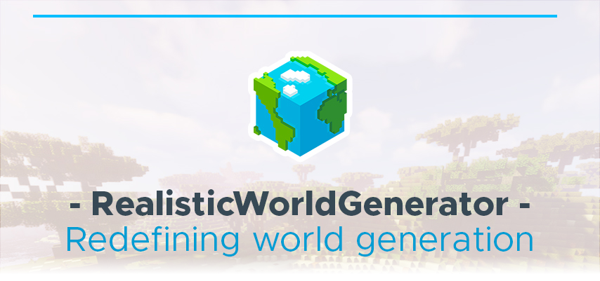

<!--
*** Thanks for checking out the Best-README-Template.
*** Thanks again! Now go create something AMAZING! :D
-->

<!-- PROJECT SHIELDS -->
<!--
*** I'm using markdown "reference style" links for readability.
*** Reference links are enclosed in brackets [ ] instead of parentheses ( ).
*** See the bottom of this document for the declaration of the reference variables
*** for contributors-url, forks-url, etc. This is an optional, concise syntax you may use.
*** https://www.markdownguide.org/basic-syntax/#reference-style-links
-->
[![Contributors][contributors-shield]][contributors-url]
[![Stargazers][stars-shield]][stars-url]
[![Issues][issues-shield]][issues-url]
[![GPLv3 License][license-shield]][license-url]

<!-- PROJECT LOGO -->
 

  

  <h3 align="center">RealisticWorldGenerator Api</h3>

  

    <!-- TODO: project_description -->
     
    <a href=""><strong>Explore the docs (Comming soon) »</strong></a>
     
     
    <a href="https://github.com/SourceWriters/RealisticWorldGenerator-Api/issues/new?labels=Bug&template=bug_report.md&title=%5BBUG%5D+Some+bug+that+happend">Report Bug</a>
    ·
    <a href="https://github.com/SourceWriters/RealisticWorldGenerator-Api/issues/new?labels=Enhancement%2C+Priority%3A+Optional&template=feature_request.md&title=%5BFEATURE%5D+Some+feature+that+could+be+cool">Request Feature</a>
  

<!-- TABLE OF CONTENTS -->

  
<h2 style="display: inline-block">Table of Contents</h2>

  <ol>
    <li>
      <a href="#about-the-project">About The Project</a>
      <ul>
        <li><a href="#built-with">Built With</a></li>
      </ul>
    </li>
    <li><a href="#issues">Issues</a></li>
    <li><a href="#roadmap">Roadmap</a></li>
    <li><a href="#contributing">Contributing</a></li>
    <li><a href="#license">License</a></li>
    <li><a href="#contact">Contact</a></li>
  </ol>

<!-- ABOUT THE PROJECT -->
## About The Project

### Built With

* [Spigot](https://hub.spigotmc.org/stash/projects/SPIGOT/repos/spigot/browse)
* [SyntaxApi](https://github.com/SyntaxPhoenix/syntaxapi)

<!-- GETTING STARTED -->
<!-- TODO: Add getting started section -->

<!-- ROADMAP -->
## Issues

Please note that every issue that doesn't use one of our templates will be marked as invalid and closed immediately. 
Our templates are easy to use and can be filled out very quickly, just because someone is too lazy to fill them out can cost a lot of time while helping you with your issue. 
Time that we can invest into more important things like development of all our projects. 
If you are too lazy to fill out a template then we're too lazy to help you resolving your issue. 
This might sound toxic or rude but the question is why should we help you with your issue if you can't take about (depending on the template) 1-5 mins to fill out a template.

<!-- ROADMAP -->
## Roadmap

See the [open issues](https://github.com/SourceWriters/RealisticWorldGenerator-Api/issues) for a list of proposed features (and known issues).

<!-- CONTRIBUTING -->
## Contributing

Contributions are what make the open source community such an amazing place to be learn, inspire, and create. Any contributions you make are **greatly appreciated**.

1. Fork the Project
2. Create your Feature Branch (`git checkout -b feature/AmazingFeature`)
3. Commit your Changes (`git commit -m 'Add some AmazingFeature'`)
4. Push to the Branch (`git push origin feature/AmazingFeature`)
5. Open a Pull Request

<!-- LICENSE -->
## License

Distributed under the GPLv3 License. See `LICENSE` for more information.

<!-- CONTACT -->
## Contact

[@SyntaxPhoenix](https://twitter.com/SyntaxPhoenix) - support@syntaxphoenix.com

Project Link: [https://github.com/SourceWriters/RealisticWorldGenerator-Api](https://github.com/SourceWriters/RealisticWorldGenerator-Api)

<!-- MARKDOWN LINKS & IMAGES -->
<!-- https://www.markdownguide.org/basic-syntax/#reference-style-links -->
[contributors-shield]: https://img.shields.io/github/contributors/SourceWriters/RealisticWorldGenerator-Api.svg?style=flat-square
[contributors-url]: https://github.com/SourceWriters/RealisticWorldGenerator-Api/graphs/contributors
[stars-shield]: https://img.shields.io/github/stars/SourceWriters/RealisticWorldGenerator-Api.svg?style=flat-square
[stars-url]: https://github.com/SourceWriters/RealisticWorldGenerator-Api/stargazers
[issues-shield]: https://img.shields.io/github/issues/SourceWriters/RealisticWorldGenerator-Api.svg?style=flat-square
[issues-url]: https://github.com/SourceWriters/RealisticWorldGenerator-Api/issues
[license-shield]: https://img.shields.io/github/license/SourceWriters/RealisticWorldGenerator-Api.svg?style=flat-square
[license-url]: https://github.com/SourceWriters/RealisticWorldGenerator-Api/blob/master/LICENSE
